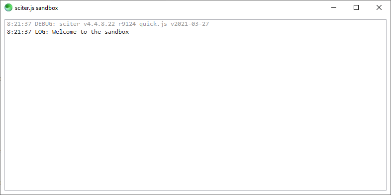

# sciter sandbox

This is a [sciter.js](https://sciter.com/) development sandbox.



## features

- works on Windows, Mac and Linux
- automatically install and configure sciter sdk (it's possible choose sdk version to install)
- start scapp or usciter with inspector
- easily test your changes with F5 reload
- javascript code linter

## requirements

- Node.js `node` (16 LTS) and its package manager `npm`.
    - On Windows [download](https://nodejs.dev/download/) and run the installer
    - On Linux check the [installation guide](https://www.digitalocean.com/community/tutorials/how-to-install-node-js-on-ubuntu-20-04#option-2-%E2%80%94-installing-node-js-with-apt-using-a-nodesource-ppa).

## start sandbox

- git clone the repository and checkout the latest release tag `git checkout 1.1.1`
- install packages `npm install`
- install latest sciter sdk `npm run install-sdk`
- start sandbox `npm run scapp`

## commands

### install sciter js sdk

```sh
npm run install-sdk [version]

# example
npm run install-sdk 4.4.8.22-bis
```

### start scapp / usciter

```sh
npm run [scapp|scapp64]

npm run [usciter|usciter64]
```

### close scapp, usciter and inspector

```sh
npm run stop
```

### lint code

Javascript code linting uses [eslint](https://github.com/eslint/eslint).

```sh
npx eslint (--fix) main.htm
```

## known issues

- all OSes: usciter does not load file (usciter bug)
- MacOS: inspector 4.4.8.22-bis may have bad CPU architecture
- Linux: inspector 4.4.8.22-bis communication issue (probably on my side)

## todo

- improve install script (check if dir exists)
- `npm run eslint`
